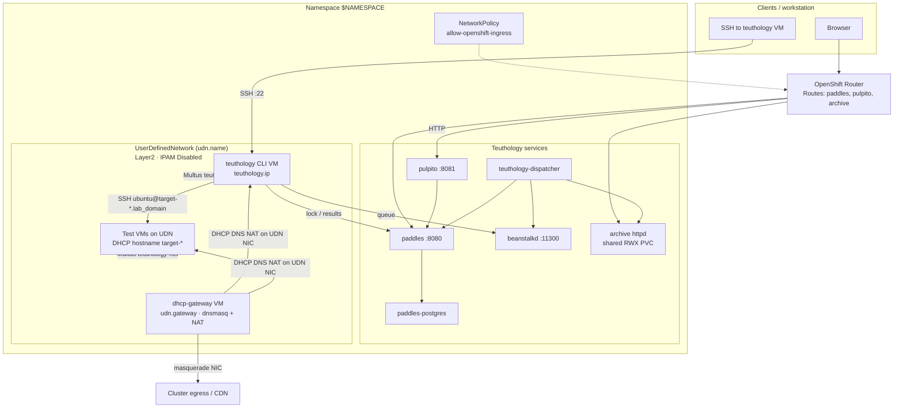

# OpenShift Teuthology Services

Deploy paddles, pulpito, beanstalkd, the job archive (httpd), teuthology-dispatcher, a teuthology CLI VirtualMachine, PostgreSQL, a namespace-scoped UserDefinedNetwork, and a DHCP/NAT gateway VirtualMachine on OpenShift using a Helm chart under `docs/openshift/`. Environment-specific settings live in `values.yaml`.

| Component | Kind | Notes |
|-----------|------|--------|
| paddles / pulpito / beanstalk / archive / dispatcher / postgres | Deployment + Service | App images from quay.io/ceph-infra by default |
| teuthology | VirtualMachinePool (replicas=1) | Dual-NIC CLI VM on UDN; Fedora DataSource |
| paddles, pulpito, archive | Route | HTTP only unless you add TLS |
| teuthology-net | UserDefinedNetwork | Namespace-scoped; IPAM Disabled |
| dhcp-gateway | VirtualMachinePool (replicas=1) | Dual-NIC VM; DHCP/DNS/NAT in guest |
| allow-openshift-ingress | NetworkPolicy | Lets the OpenShift router reach app pods |

## Architecture



Pod network carries app traffic (Services / Routes). The UDN is a private L2 overlay for guest addressing; the dhcp-gateway VM is the only DHCP/DNS/NAT server on that network (namespace-scoped). The **teuthology CLI VM** is dual-NIC (masquerade + UDN): it talks to paddles/beanstalk over the pod network and to `target-*.<lab_domain>` over the UDN using dhcp-gateway **dynamic** DNS. Test VMs are reachable from that CLI VM when the OpenShift provisioner attaches the UDN (`udn.name` / `openshift.udn_name`) with the paddles MAC on that NIC and the guest DHCP client registers the paddles **shortname**. Lock does not pin a stable IP; dnsmasq maps the current lease to `target-00.<lab_domain>`. If `openshift.udn_name` is empty, the guest stays on masquerade and will not appear in UDN DNS. Chart defaults for subnet, gateway, lab domain, and machine type are in `values.yaml`; override them for your cluster.

## Prerequisites

* An OpenShift cluster with `oc` and `helm` configured, OVN-Kubernetes, and Multus
* OpenShift Virtualization installed, with OS DataSources available (set `*.dataSource.namespace` to `<datasource-namespace>` if they are not in the chart namespace; chart default name is `fedora`)
* Cluster nodes must be able to pull from [quay.io/ceph-infra](https://quay.io/organization/ceph-infra) (and Docker Hub for `httpd`, `busybox`, `curlimages/curl`, unless you override those images). For private quay repos, configure `imagePullSecrets` on the deployments or link a puller SA to the project
* A `ReadWriteMany` storage class for the shared archive PVC and the dhcp-gateway / teuthology **CLI** VM disks (`archive.storageClassName`, `dhcpGateway.storageClassName`, `teuthology.storageClassName`). Guest test VMs use a **separate** pair in `openshift.root_storage_class` (OS disk) and `openshift.data_storage_class` (extra volumes from user-data); they may be the same class or different ones. The OpenShift provisioner requires both guest classes in `~/.teuthology.yaml` / Helm `openshift.*`
* Permission to create `VirtualMachinePool` / `VirtualMachine` / `DataVolume` / `NetworkPolicy` in the namespace (no privileged SCC — DHCP runs inside the dhcp-gateway guest)
* A load balancer (MetalLB or equivalent) for EXTERNAL-IP on Services `dhcp-gateway` and `teuthology` (SSH port 22). Guest DNS stays on the UDN NIC
* Run `teuthology-lock` from the **teuthology VM** (SSH to its LoadBalancer IP). A workstation does not need a UDN route if you do that

## Recommended order

1. Export namespace and install the chart (creates UDN, apps, NetworkPolicy, dhcp-gateway VM, teuthology CLI VM)
2. Wait for core Deployments and both VMs Ready (cloud-init may take several minutes after Ready; teuthology bootstrap can take longer)
3. Set `paddles.jobLogHrefTempl` from the archive Route and upgrade
4. Seed paddles nodes as **FQDNs** (`target-00.<lab_domain>`) **with a unique `mac_address` per node**. The OpenShift provisioner stamps that MAC on the UDN NIC. Do **not** put `target-*` in `dhcpGateway.dhcpHosts` (IPs stay dynamic). Keep a static lease only for the teuthology CLI VM
5. Confirm paddles knows the FQDN (see commands below)
6. Put lab SSH **public** keys in `teuthology/ocp/user_data/` (not the locker’s `~/.ssh` at runtime). Set `openshift.root_storage_class` / `data_storage_class` in values or `~/.teuthology.yaml`
7. Create a ServiceAccount and put its token (and CA if required) in teuthology.yaml ([Service account](#service-account-for-the-openshift-provisioner))
8. SSH to the teuthology VM and run lock/reimage there (`target-*.<lab_domain>` comes from DHCP hostname + dnsmasq)

### Environment variables

Set these once; they must match `values.yaml` (`dispatcher.labDomain`, `dispatcher.tube`, `udn.name`):

```bash
export NAMESPACE=teuthology
export LAB_DOMAIN=ocpvirt.local
export MACHINE_TYPE=ocpvirt
export UDN_NAME=teuthology-net
export SA=teuthology-provisioner
```

Replace the values with your namespace, DNS domain, paddles `machine_type` / dispatcher tube, UDN name, and ServiceAccount name. The examples match chart defaults in `values.yaml`. Later commands use these variables.

## Configure values.yaml

Edit `docs/openshift/values.yaml` for your cluster. Change `postgres.password`, `dispatcher.labDomain`, `dispatcher.tube`, UDN addressing, storage classes, and images as needed. The snippet below is the chart defaults, not a lab-specific overlay.

App images default to [quay.io/ceph-infra](https://quay.io/organization/ceph-infra). Override any `*.image` to use another registry, tag, or a locally built image.

```yaml
postgres:
  image: quay.io/ceph-infra/teuthology-postgresql:latest
  password: secret
  storage: 100Gi

paddles:
  image: quay.io/ceph-infra/paddles:latest
  workerCount: "4"
  # Required after first deploy — replace with the archive Route host (see Deploy)
  jobLogHrefTempl: http://archive/{run_name}/{job_id}/teuthology.log

pulpito:
  image: quay.io/ceph-infra/pulpito:latest

beanstalk:
  image: quay.io/ceph-infra/teuthology-beanstalkd:latest
  serviceType: LoadBalancer

archive:
  image: httpd:2.4
  storage: 100Gi
  accessMode: ReadWriteMany
  # storageClassName: <rwx-storage-class>

dispatcher:
  image: quay.io/ceph-infra/teuthology-dev:main
  tube: ocpvirt
  labDomain: ocpvirt.local

teuthology:
  enabled: true
  mac: "52:54:00:d4:c9:09"
  ip: 192.168.14.9
  sshUser: teuthology
  password: passwd
  gitUrl: https://github.com/ceph/teuthology.git
  gitBranch: main

# Guest VMs created by teuthology-lock (not Helm infra disks).
openshift:
  vcpus: 4
  ram: 8Gi
  root_storage_size: 40Gi
  # root_storage_class: <rwx-storage-class>
  # data_storage_class: <rwx-storage-class>

udn:
  name: teuthology-net
  subnet: 192.168.0.0/20
  gateway: 192.168.0.8
  prefix: 20
  netmask: 255.255.240.0
  dhcpRangeStart: 192.168.14.10
  dhcpRangeEnd: 192.168.15.253

dhcpGateway:
  replicas: 1
  # storageClassName: <rwx-storage-class>
  mac: "52:54:00:d4:c9:08"
  sshUser: teuthology
  password: passwd
  sshAuthorizedKeys:
    - ssh-ed25519 AAAA... your-key
  dhcpHosts: |
    dhcp-host=52:54:00:d4:c9:09,192.168.14.9,teuthology
```

Do not put paddles `target-*` inventory in `values.yaml` or `dhcpGateway.dhcpHosts`. Register node **names** in paddles; UDN addresses are assigned at lock time (see below).

Examples of image overrides:

```bash
# Pin a tag
--set pulpito.image=quay.io/ceph-infra/pulpito:main

# Use a private or in-cluster build
--set dispatcher.image=image-registry.openshift-image-registry.svc:5000/$NAMESPACE/teuthology:latest
```

## Optional: build custom images

Only needed if you override the quay.io/ceph-infra defaults. Examples use `podman`.

Clone and build paddles and pulpito:

```bash
git clone https://github.com/ceph/paddles.git
cd paddles && podman build . --file Dockerfile --tag paddles

git clone https://github.com/ceph/pulpito.git
cd pulpito && podman build . --file Dockerfile --tag pulpito
```

Build beanstalkd from this repository:

```bash
cd beanstalk/alpine && podman build . --file Dockerfile --tag beanstalkd
```

Build the teuthology (dispatcher) image from this repository:

```bash
podman build -f docs/docker-compose/teuthology/Dockerfile --tag teuthology .
```

The compose Dockerfile is a starting point for the dispatcher container. It does not install the OpenShift/Kubernetes Python client. Prefer running `teuthology-lock` / reimage from a host that has `openshift.server` and `openshift.token` in teuthology.yaml, unless you extend the dispatcher image.

Tag and push to a registry your cluster can pull from, then set the matching `*.image` values (or `--set`) before deploy.

## Deploy

Install the chart:

```bash
helm upgrade --install teuthology docs/openshift \
  --namespace $NAMESPACE \
  --create-namespace \
  --history-max 3 \
  -f docs/openshift/values.yaml
```

Wait for the UDN, core apps, dhcp-gateway, and teuthology CLI VM (VirtualMachinePool `replicas: 1`, `runStrategy: Always`):

```bash
oc get userdefinednetwork -n $NAMESPACE
for d in paddles pulpito beanstalk archive dispatcher paddles-postgres; do
  oc rollout status deploy/$d -n $NAMESPACE
done
oc get vmpool,vm,vmi -n $NAMESPACE -l 'app in (dhcp-gateway,teuthology)'
oc wait -n $NAMESPACE --for=condition=Ready vm -l app=dhcp-gateway --timeout=20m
oc wait -n $NAMESPACE --for=condition=Ready vm -l app=teuthology --timeout=20m
# Optional: confirm DHCP service inside the gateway guest (after cloud-init finishes)
ssh teuthology@$(oc get svc dhcp-gateway -n $NAMESPACE -o jsonpath='{.status.loadBalancer.ingress[0].ip}') \
  'systemctl is-active teuthology-udn-gateway dnsmasq'
# CLI VM (password default: passwd). Bootstrap of /opt/teuthology may still be running.
ssh teuthology@$(oc get svc teuthology -n $NAMESPACE -o jsonpath='{.status.loadBalancer.ingress[0].ip}')
```

No SCC grant is required. DHCP/DNS/NAT is configured by cloud-init inside the guest. First boot installs packages from the guest OS repositories.

To render manifests without Helm install:

```bash
helm template teuthology docs/openshift \
  -f docs/openshift/values.yaml | oc apply -n $NAMESPACE -f -
```

After Routes exist, set paddles’ log URL to the archive Route (required; the default placeholder is not usable) and upgrade:

```bash
ARCHIVE_HOST=$(oc get route archive -n $NAMESPACE -o jsonpath='{.spec.host}')
helm upgrade teuthology docs/openshift \
  --namespace $NAMESPACE \
  --history-max 3 \
  --set paddles.jobLogHrefTempl="http://${ARCHIVE_HOST}/{run_name}/{job_id}/teuthology.log" \
  -f docs/openshift/values.yaml
```

If Routes use edge TLS, use `https://` in `jobLogHrefTempl` and in client `lock_server` / `results_*` URLs as appropriate.

## Routes and external access

The chart creates Routes for `paddles`, `pulpito`, and `archive` (no TLS by default — use **http://**). Print UI URLs:

```bash
echo "http://$(oc get route pulpito -n $NAMESPACE -o jsonpath='{.spec.host}')"
echo "http://$(oc get route paddles -n $NAMESPACE -o jsonpath='{.spec.host}')"
echo "http://$(oc get route archive -n $NAMESPACE -o jsonpath='{.spec.host}')"
```

Many namespaces ship a restrictive NetworkPolicy that only allows a specific ingresscontroller shard. The chart also creates `allow-openshift-ingress` so the default OpenShift router can reach app pods. Without that (or an equivalent policy), Routes return **503** even when pods are Ready.

## UserDefinedNetwork

The chart creates a namespace-scoped `UserDefinedNetwork` (`udn.name`, default `teuthology-net`): Layer2 secondary overlay with IPAM disabled. OVN is a pure L2 pipe; addressing comes from the dhcp-gateway VM.

OVN creates a Multus `NetworkAttachmentDefinition` with the same name. The dhcp-gateway VM attaches to it as a secondary NIC (`l2bridge`).

```bash
oc get userdefinednetwork -n $NAMESPACE
oc get network-attachment-definitions -n $NAMESPACE
```

Expect `NetworkCreated=True`. Spec is immutable; changing IPAM requires delete and recreate after detaching consumers.

## DHCP and gateway

A `VirtualMachinePool` named `dhcp-gateway` keeps **replicas: 1**. The VM template uses `runStrategy: Always`, so if the VMI (or the VM object) is deleted, the pool recreates it. Cloud-init installs dnsmasq/nftables and enables `teuthology-udn-gateway.service`, which configures `udn.gateway`/`udn.prefix` on the UDN NIC, DHCP/DNS, and SNAT out masquerade — without a privileged pod.

Set `dhcpGateway.sshAuthorizedKeys` before deploy (optional; password login works with the defaults). SSH via the LoadBalancer Service:

```bash
oc get svc dhcp-gateway -n $NAMESPACE
ssh teuthology@$(oc get svc dhcp-gateway -n $NAMESPACE -o jsonpath='{.status.loadBalancer.ingress[0].ip}')
# default password: passwd
```

Override credentials at deploy time:

```bash
helm upgrade --install teuthology docs/openshift \
  --namespace $NAMESPACE \
  --history-max 3 \
  --set dhcpGateway.sshUser=teuthology \
  --set dhcpGateway.password=mypassword \
  -f docs/openshift/values.yaml
```

(Changing credentials on an already-provisioned disk requires recreating the VM disk or updating the guest user manually — cloud-init runs on first boot.)

`dhcpGateway.dhcpHosts` is **only** for long-lived infra on the UDN (the teuthology CLI VM). It is not paddles inventory and must not list `target-*`. Lock/reimage creates a new guest, typically with a new MAC and a new address from the dynamic pool; Helm cannot pin that mapping.

```yaml
dhcpGateway:
  dhcpHosts: |
    dhcp-host=<teuthology.mac>,<teuthology.ip>,teuthology
```

That file is also mirrored to ConfigMap `dhcp-hosts`. Cloud-init copies it into the gateway guest on **first boot**. After changing infra leases on a running guest, edit `/etc/dnsmasq.d/dhcp-hosts.conf` and `systemctl restart dnsmasq`, or helm upgrade and replace the VM disk so cloud-init runs again.

Reserve the CLI VM just **below** the dynamic pool (`teuthology.ip`). Do not use `udn.gateway`. Target VMs take any free address in `udn.dhcpRangeStart`–`udn.dhcpRangeEnd`.

**Dynamic DNS for lock guests:** dnsmasq on the gateway UDN NIC uses `domain=<labDomain>` (`dispatcher.labDomain`) and the DHCP pool. When a guest’s DHCP client sends hostname `target-00` (cloud-init / KubeVirt shortname), dnsmasq registers **`target-00.<lab_domain>` → current lease IP**. The next lock of the same paddles name may get a different IP; DNS follows the new lease. Stale names can linger until the old lease expires (12h in the gateway config) unless the guest releases DHCP on teardown.

That DNS is namespace-specific; it is **not** CoreDNS and is **not** on Service `dhcp-gateway` (SSH :22 only). Run **one** DHCP/DNS server per namespace on this UDN.

Workstations typically do **not** use this resolver. Run teuthology on the CLI VM instead. See [Teuthology CLI VM](#teuthology-cli-vm).

## Register paddles nodes

Store **FQDNs** in paddles. `teuthology-lock` looks up `canonicalize_hostname()`, which appends `lab_domain` (`target-00` → `target-00.<lab_domain>`). Short names (`target-00`) are the KubeVirt `VirtualMachine` name and the **DHCP hostname** the guest must send so dnsmasq can publish the FQDN. Do not pre-create `dhcp-host=` lines for these names.

| Layer | Form | Example |
|-------|------|---------|
| paddles `nodes.name` | FQDN (`lab_domain`) | `target-00.<lab_domain>` |
| paddles `mac_address` | UDN NIC MAC (required with UDN) | unique per node |
| KubeVirt `VirtualMachine` | shortname | `target-00` |
| DHCP client hostname | shortname (dynamic) | `target-00` |
| SSH / DNS | FQDN → current lease | `target-00.<lab_domain>` |

Paddles `mac_address` is **required** when `openshift.udn_name` is set: the provisioner copies it onto the UDN interface. It is **not** a Helm DHCP reservation — leave `target-*` out of `dhcpGateway.dhcpHosts` so the address still comes from the dynamic pool.

Seed via SQL (set `PGPASSWORD` to match `postgres.password` in values). Use a unique MAC per node:

```bash
oc exec -i -n $NAMESPACE deploy/paddles-postgres -- \
  env PGPASSWORD=secret psql -U paddles -d paddles <<SQL
insert into nodes (name, machine_type, is_vm, locked, up, mac_address) values
('target-00.${LAB_DOMAIN}', '${MACHINE_TYPE}', true, false, false, '52:54:00:d4:ca:00'),
('target-01.${LAB_DOMAIN}', '${MACHINE_TYPE}', true, false, false, '52:54:00:d4:ca:01'),
('target-02.${LAB_DOMAIN}', '${MACHINE_TYPE}', true, false, false, '52:54:00:d4:ca:02'),
('target-03.${LAB_DOMAIN}', '${MACHINE_TYPE}', true, false, false, '52:54:00:d4:ca:03');
SQL
```

If nodes were already seeded as short names, append `LAB_DOMAIN`:

```bash
oc exec -i -n $NAMESPACE deploy/paddles-postgres -- \
  env PGPASSWORD=secret psql -U paddles -d paddles -c \
  "UPDATE nodes SET name = name || '.${LAB_DOMAIN}'
   WHERE machine_type='${MACHINE_TYPE}' AND name NOT LIKE '%.%';"
```

If those rows have no MAC, set unique addresses (UDN attach fails without `mac_address`):

```bash
oc exec -i -n $NAMESPACE deploy/paddles-postgres -- \
  env PGPASSWORD=secret psql -U paddles -d paddles -c \
  "UPDATE nodes SET mac_address = '52:54:00:d4:ca:' || lpad(to_hex(id % 256), 2, '0')
   WHERE machine_type='${MACHINE_TYPE}' AND (mac_address IS NULL OR mac_address = '');"
```

Prefer explicit MACs per node rather than deriving them from database ids.

Or via the paddles API (use `https://` only if the Route has TLS):

```bash
PADDLES=$(oc get route paddles -n $NAMESPACE -o jsonpath='{.spec.host}')
curl -X POST "http://${PADDLES}/nodes/" \
  -H 'Content-Type: application/json' \
  -d "{\"name\":\"target-00.${LAB_DOMAIN}\",\"machine_type\":\"${MACHINE_TYPE}\",\"is_vm\":true,\"up\":true,\"locked\":false,\"mac_address\":\"52:54:00:d4:ca:00\"}"
curl -sf "http://${PADDLES}/nodes/target-00.${LAB_DOMAIN}/"
```

`machine_type` must match `dispatcher.tube` and `openshift.machine_types`. `teuthology-lock --lock target-00` queries **`target-00.<lab_domain>`**.

## Teuthology CLI VM

This is a Fedora KubeVirt VM (`VirtualMachinePool` `teuthology`), not the `teuthology-dev` container image (that image is only for `deploy/dispatcher`).

Dual NIC:

* **masquerade** — default route, cluster DNS, `paddles` / `beanstalk` / git
* **UDN** (`udn.name`, MAC `teuthology.mac`) — DHCP client; **static** lease `teuthology.ip` / hostname `teuthology` in `dhcpGateway.dhcpHosts` (infra only)

Cloud-init writes `/etc/teuthology.yaml` (`lab_domain`, in-cluster paddles/beanstalk URLs), brings the UDN NIC up with DHCP, and points `*.<lab_domain>` at dhcp-gateway DNS. If `teuthology.install` is true, a oneshot clones `teuthology.gitUrl` into `/opt/teuthology` and runs `./bootstrap` (can take a long time; first boot dnf/git must reach the internet via masquerade).

SSH (Service `teuthology`, LoadBalancer, default user/password `teuthology` / `passwd`):

```bash
ssh teuthology@$(oc get svc teuthology -n $NAMESPACE -o jsonpath='{.status.loadBalancer.ingress[0].ip}')
systemctl status teuthology-udn-client teuthology-bootstrap
ip -4 addr show
getent hosts paddles.$NAMESPACE.svc.cluster.local
getent hosts teuthology.${LAB_DOMAIN}
getent hosts target-00.${LAB_DOMAIN}
# after bootstrap:
export PATH="$PATH:/opt/teuthology/.venv/bin"
teuthology-lock --list -t "$MACHINE_TYPE"
```

From this VM, `ubuntu@target-00.<lab_domain>` works after lock when that guest is on the UDN and registered its shortname with dhcp-gateway. The IP is whatever dnsmasq leased this time (`getent hosts`, not Helm). Guest login keys come from `teuthology/ocp/user_data/` (see [SSH keys](#ssh-keys-in-ocpuser_data)), not from copying into cloud-init at lock time.

Changing the **CLI VM** MAC/IP requires a matching infra `dhcp-host=` line and a helm upgrade; recreate that VM disk if cloud-init already ran. Do not add `target-*` leases there.

## Workstation access to test VMs

This section applies when guests are **on the UDN** (Multus `udn.name` plus a DHCP hostname matching the paddles shortname). This chart only deploys the UDN, dhcp-gateway, and the teuthology CLI VM. The OpenShift provisioner attaches the UDN NIC, stamps the paddles MAC, and dual-DHCP (`eth0` masquerade + `eth1` UDN) via user-data. If `openshift.udn_name` is empty, guests stay masquerade-only and do not appear in dhcp-gateway DNS.

After lock, teuthology SSHes as `ubuntu@<shortname>.<lab_domain>`. UDN guests get a **dynamic** address in the DHCP pool. That name/IP pair is not on the cluster pod network and is not stored in Helm.

**Check from the lock host (the teuthology CLI VM):**

```bash
getent hosts target-00.${LAB_DOMAIN}
ping -c1 "$(getent hosts target-00.${LAB_DOMAIN} | awk '{print $1; exit}')"
ssh -o ConnectTimeout=5 ubuntu@target-00.${LAB_DOMAIN}
```

If the name does not resolve, the guest did not DHCP on the UDN with hostname `target-00`, or the old lease is still held. If the name resolves but SSH times out, you have no route into the UDN subnet (run this on the CLI VM, not a laptop).

**Option A — split DNS (only if the lock host can already route to the UDN):** forward only `<lab_domain>` to `udn.gateway` from `values.yaml`. Hosts on the cluster/pod network usually cannot reach that address. Example check:

```bash
dig @<udn.gateway> target-00.${LAB_DOMAIN}
```

Do not put `target-*` into `dhcpGateway.dhcpHosts` or `/etc/hosts`. Those IPs change at lock.

**Option B (preferred) — teuthology CLI VM:** SSH to Service `teuthology` and run lock/reimage there. That guest is on the UDN, uses dhcp-gateway DNS, and does not need workstation routes. See [Teuthology CLI VM](#teuthology-cli-vm).

Do not invent a second DNS service for the namespace: guests already use dhcp-gateway dnsmasq. Optional later work is exposing UDP/TCP 53 on Service `dhcp-gateway` for workstations; SSH from a laptop to UDN guests still needs a route into the UDN.

## OpenShift Virtualization

This chart does not create test VMs. Lock/reimage uses the OpenShift provisioner. Prefer running it **on the teuthology CLI VM** (already has `lab_domain` and paddles URLs). The provisioner authenticates with a ServiceAccount **token** (and an optional CA) from teuthology.yaml, not a personal `oc login`. The `teuthology-dev` extra is for containers/workstations, not this Fedora guest:

```bash
# on the teuthology VM, after bootstrap:
cd /opt/teuthology && pip install -e '.[openshift]'
```

### Service account for the OpenShift provisioner

Create a namespace-scoped ServiceAccount that can manage VirtualMachines (and related objects) in `$NAMESPACE`. Bind the built-in `admin` role in that namespace so the client can create and delete VMs, DataVolumes, and secrets used by cloud-init.

```bash
oc create serviceaccount "$SA" -n "$NAMESPACE"

oc adm policy add-role-to-user admin \
  -z "$SA" -n "$NAMESPACE"
```

Kubernetes 1.24+ does not create a long-lived token Secret automatically. Request one:

```bash
oc apply -n "$NAMESPACE" -f - <<EOF
apiVersion: v1
kind: Secret
metadata:
  name: ${SA}-token
  annotations:
    kubernetes.io/service-account.name: ${SA}
type: kubernetes.io/service-account-token
EOF

until TOKEN_B64=$(oc get secret "${SA}-token" -n "$NAMESPACE" -o jsonpath='{.data.token}') && [[ -n "$TOKEN_B64" ]]; do
  sleep 1
done
```

Extract the API server URL and bearer token:

```bash
SERVER=$(oc config view --minify -o jsonpath='{.clusters[0].cluster.server}')
TOKEN=$(oc get secret "${SA}-token" -n "$NAMESPACE" -o jsonpath='{.data.token}' | base64 -d)
```

Add `certificate_authority_data` only if the API server uses a CA that is **not** in the lock host’s system trust store (typical for a private cluster CA). Skip it when the API cert is publicly trusted.

```bash
CA_DATA=$(oc config view --raw --minify -o jsonpath='{.clusters[0].cluster.certificate-authority-data}')
```

Verify:

```bash
oc login --token="$TOKEN" --server="$SERVER"
# if TLS fails, pass the CA:  --certificate-authority=<(printf '%s' "$CA_DATA" | base64 -d)
oc whoami
# system:serviceaccount:<namespace>:<sa>
```

Put `server` and `token` (and `certificate_authority_data` only when required) under `openshift:` in teuthology.yaml on the lock host. Do not commit them.

```yaml
openshift:
  server: "<api-server>"     # $SERVER
  token: "<sa-bearer-token>" # $TOKEN
  # certificate_authority_data: "<base64-ca>"  # $CA_DATA, only if TLS verify needs it
```

On the teuthology CLI VM, merge those keys into `/etc/teuthology.yaml` (Helm writes the rest of the `openshift:` block at first boot). Cloud-init does not re-run on later helm upgrades unless you recreate the VM disk.

```bash
TEUTH_IP=$(oc get svc teuthology -n "$NAMESPACE" -o jsonpath='{.status.loadBalancer.ingress[0].ip}')
ssh teuthology@"$TEUTH_IP"
# edit /etc/teuthology.yaml — add server, token, and certificate_authority_data if needed
```

If DataSources live in another namespace (`openshift.datasource_namespace`), namespace `admin` on `$NAMESPACE` is still enough for VM create; the cluster CDI/virt controllers read those DataSources. Grant extra RBAC only if lock fails with a forbidden error on that namespace.

To rotate, delete Secret `${SA}-token`, recreate it, and replace `openshift.token`. To revoke: `oc delete serviceaccount "$SA" -n "$NAMESPACE"`.

Helm writes the `openshift:` block into `/etc/teuthology.yaml` on the CLI VM and dispatcher. For a workstation, configure `~/.teuthology.yaml` (see also `docs/siteconfig.rst`):

```yaml
lock_server: http://paddles.<route-host>/
results_server: http://paddles.<route-host>/
results_ui_server: http://pulpito.<route-host>/
queue_host: <beanstalk-reachable-address>
queue_port: 11300
lab_domain: <lab_domain>
archive_base: /path/to/local-or-mounted-archive
ssh_key: ~/.ssh/id_ed25519   # private key matching pubkeys in ocp/user_data

openshift:
  namespace: <namespace>           # same as $NAMESPACE
  machine_types: ['<machine_type>']  # match paddles machine_type and dispatcher.tube
  user_data: teuthology/ocp/user_data/ocp-{os_type}-{os_version}-user-data.txt
  server: https://api.example.com:6443
  token: <service-account-token>
  # certificate_authority_data: <base64-ca>  # only if TLS verify needs a private CA
  udn_name: <udn.name>             # empty string = masquerade only, no UDN NIC
  udn_binding: l2bridge
  datasource_namespace: <datasource-namespace>
  vcpus: 4
  ram: 8Gi
  root_storage_size: 40Gi
  root_storage_class: <rwx-storage-class>   # required: guest OS disk
  data_storage_class: <rwx-storage-class>   # required: extra disks from user-data volumes
```

`lab_domain` must match `dispatcher.labDomain`. Replace `<route-host>` with hosts from `oc get routes -n $NAMESPACE`. `vcpus`, `ram`, `root_storage_size`, `root_storage_class`, and `data_storage_class` are required at lock time.

### Guest storage classes

Helm `archive.storageClassName` / `dhcpGateway.storageClassName` / `teuthology.storageClassName` apply only to **infra** PVCs and the CLI / dhcp-gateway VM disks.

Lock/reimage guests use a different pair:

| Disk | Source | Config |
|------|--------|--------|
| Root (OS) | OpenShift Virtualization DataSource | `openshift.root_storage_size` + `openshift.root_storage_class` |
| Extra (OSD-style) | `volumes:` in the OS user-data file | `openshift.data_storage_class` |

The two classes may be the same RWX class, or different (for example a faster class for root and a denser class for data). Uncomment them in `docs/openshift/values.yaml` so the CLI VM and dispatcher pick them up.

### SSH keys in `ocp/user_data`

Authorized keys are **baked into** `teuthology/ocp/user_data/ocp-{os_type}-{os_version}-user-data.txt`. The provisioner does not copy keys from the locker’s `~/.ssh` at runtime.

Edit both templates (Ubuntu and CentOS Stream) under `ssh_authorized_keys`:

```yaml
users:
  - name: ubuntu
    groups: sudo          # wheel on CentOS Stream
    shell: /bin/bash
    sudo: ["ALL=(ALL) NOPASSWD:ALL"]
    ssh_authorized_keys:
      - ssh-ed25519 AAAA... teuthology@teuthology
```

Put the **public** half of the key the lock host uses (`ssh_key` / `~/.ssh/id_ed25519` on the CLI VM). After first boot on the CLI VM:

```bash
# on the teuthology VM
test -f ~/.ssh/id_ed25519 || ssh-keygen -t ed25519 -N '' -f ~/.ssh/id_ed25519
cat ~/.ssh/id_ed25519.pub
# paste into teuthology/ocp/user_data/*.txt in the clone, then lock/reimage
```

Login user in the shipped templates is `ubuntu` for both Ubuntu and CentOS Stream.

The same files may list extra blank disks. That `volumes:` key is teuthology-only (stripped before cloud-init), same role as OpenStack volumes:

```yaml
volumes:
  - count: 3
    size: 15  # Gi
  - count: 2
    size: 20  # Gi
```

User-data also enables DHCP on `eth0` (masquerade) and `eth1` (UDN).

### Lock / reimage

Beanstalk defaults to `serviceType: LoadBalancer` so workstations can use the EXTERNAL-IP as `queue_host`. Override with `beanstalk.serviceType=ClusterIP` for in-cluster-only access.

```bash
oc get svc beanstalk -n $NAMESPACE
# EXTERNAL-IP → queue_host in ~/.teuthology.yaml (port 11300)
```

In-cluster processes can use `beanstalk` or `beanstalk.$NAMESPACE.svc.cluster.local`.

After paddles nodes (FQDNs **and MACs**) are in place:

```bash
# teuthology-lock looks up target-00.<lab_domain>
teuthology-lock --lock target-00 --machine-type "$MACHINE_TYPE" --os-type ubuntu --os-version 22.04
# or:
teuthology-lock --lock-many 1 -m "$MACHINE_TYPE" --os-type ubuntu --os-version 22.04
```

The provisioner creates a `VirtualMachine` named **shortname** in `$NAMESPACE`, attaches `udn_name` with the paddles MAC, clones the OS DataSource onto the root PVC (`root_storage_class`), and adds extra DataVolumes (`data_storage_class`) from user-data `volumes:`. Cloud-init comes from `teuthology/ocp/user_data/`. On unlock/reimage teardown it deletes the VM.

**Networking:** do not expect a Helm `dhcp-host` for that name. The guest DHCPs on the UDN and must send hostname **shortname** so `shortname.<lab_domain>` resolves on the CLI VM. Set `udn_name: ""` only if you want masquerade/pod IPs and no `*.<lab_domain>` record.

## Verify

Wait for core workloads:

```bash
oc get userdefinednetwork -n $NAMESPACE
oc get vmpool,vm,vmi -n $NAMESPACE -l app=dhcp-gateway
oc get all -n $NAMESPACE
```

Check PostgreSQL:

```bash
oc exec -n $NAMESPACE deploy/paddles-postgres -- pg_isready -U paddles -d paddles
```

Check paddles:

```bash
oc exec -n $NAMESPACE deploy/paddles -- curl -sf http://localhost:8080
```

Check pulpito:

```bash
oc exec -n $NAMESPACE deploy/pulpito -- curl -sf http://localhost:8081
echo "http://$(oc get route pulpito -n $NAMESPACE -o jsonpath='{.spec.host}')"
```

Check beanstalk:

```bash
oc get svc beanstalk -n $NAMESPACE
```

Check archive:

```bash
oc exec -n $NAMESPACE deploy/archive -- curl -sf http://localhost:8080/
```

Check dispatcher:

```bash
oc logs -n $NAMESPACE deploy/dispatcher --tail=50
```

Check the teuthology CLI VM:

```bash
oc get vmpool,vm,vmi,svc -n $NAMESPACE -l app=teuthology
oc wait -n $NAMESPACE --for=condition=Ready vm -l app=teuthology --timeout=20m
ssh teuthology@$(oc get svc teuthology -n $NAMESPACE -o jsonpath='{.status.loadBalancer.ingress[0].ip}') \
  'systemctl is-active teuthology-udn-client; getent hosts paddles.'"$NAMESPACE"'.svc.cluster.local'
```

Check UDN / DHCP / routes:

```bash
oc get userdefinednetwork,network-attachment-definitions -n $NAMESPACE
oc get vmpool,vm,vmi,svc -n $NAMESPACE -l 'app in (dhcp-gateway,teuthology)'
oc get routes -n $NAMESPACE
```

After a successful lock (from the teuthology CLI VM):

```bash
oc get vm,vmi -n $NAMESPACE
getent hosts target-00.${LAB_DOMAIN}   # IP is the current DHCP lease, not Helm
```

## Notes

* Prefer managing postgres credentials outside git for production.
* Do not reuse a PostgreSQL PVC across major image version changes (e.g. Docker Hub `postgres` vs `teuthology-postgresql` PG14); wipe or migrate the PVC if the server fails on `postgresql.conf`.
* `paddles.workerCount` defaults to `"4"`; without it, gunicorn may spawn hundreds of workers on large nodes and stop serving HTTP.
* Routes omit `spec.host` so OpenShift assigns hostnames; set `spec.host` in templates if you need fixed DNS.
* Routes are plain HTTP unless you add `spec.tls`; prefer `http://` URLs (https without TLS termination yields router 503).
* NetworkPolicy `allow-openshift-ingress` lets the OpenShift router reach Services when a tenant policy would otherwise block it.
* Archive and **infra** VM disks default to `ReadWriteMany`; set Helm `*.storageClassName` to `<rwx-storage-class>` when the cluster requires an explicit RWX class. Guest OS vs extra disks use `openshift.root_storage_class` and `openshift.data_storage_class` (required by the provisioner).
* DHCP/NAT/DNS runs in a dual-NIC gateway VM (`VirtualMachinePool` replicas=1); no privileged SCC. DHCP and guest DNS are limited to this namespace’s UDN L2 domain.
* `*.<lab_domain>` for **targets** is dynamic DHCP DNS on the dhcp-gateway UDN NIC, not CoreDNS and not `dhcpGateway.dhcpHosts`. Run lock/SSH from the teuthology CLI VM.
* `dhcpGateway.dhcpHosts` is infra-only (teuthology CLI VM). Do not add `target-*`; guest IPs stay in the dynamic pool. Paddles `mac_address` is reused on the UDN NIC but is not a dnsmasq reservation.
* `teuthology-dev` is a container image (dispatcher only). The CLI host is a Fedora KubeVirt VM on the UDN.
* Paddles node names must be FQDNs (`target-00.<lab_domain>`); KubeVirt VM names and DHCP hostnames stay short. With UDN, each node needs a unique `mac_address`.
* Guest SSH keys live in `teuthology/ocp/user_data/`; they are not taken from the locker’s `~/.ssh` at lock time.
* The OpenShift provisioner uses `openshift.server` and `openshift.token` (optional `certificate_authority_data`). Create a ServiceAccount token; do not use a personal `oc login`.
* This chart does not create test VMs. The OpenShift provisioner attaches `udn.name` unless `openshift.udn_name` is empty.
* Use namespace-scoped `UserDefinedNetwork`, not a cluster-wide UDN, so DHCP stays in the project.
* Helm keeps `--history-max 3` release Secrets; pass the same flag on every upgrade.

## Uninstall

```bash
# Detach VMs from the UDN first if any remain, then:
helm uninstall teuthology -n $NAMESPACE
oc delete userdefinednetwork "$UDN_NAME" -n $NAMESPACE --ignore-not-found
# PVCs (postgres, archive, dhcp-gateway disk) are retained unless you delete them:
oc delete pvc -l app=dhcp-gateway -n $NAMESPACE --ignore-not-found
oc delete pvc paddles-postgres-data teuthology-archive -n $NAMESPACE --ignore-not-found
```
