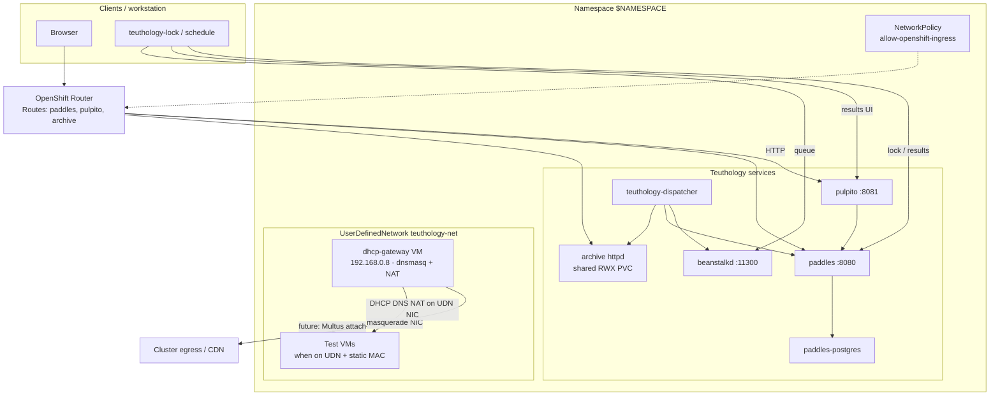

# OpenShift Teuthology Services

Deploy paddles, pulpito, beanstalkd, the job archive (httpd), teuthology-dispatcher, PostgreSQL, a namespace-scoped UserDefinedNetwork, and a DHCP/NAT gateway VirtualMachine on OpenShift using a Helm chart under `docs/openshift/`. Environment-specific settings live in `values.yaml` (or an overlay such as `values-runtime-int.yaml`).

| Component | Kind | Notes |
|-----------|------|--------|
| paddles / pulpito / beanstalk / archive / dispatcher / postgres | Deployment + Service | App images from quay.io/ceph-infra by default |
| paddles, pulpito, archive | Route | HTTP only unless you add TLS |
| teuthology-net | UserDefinedNetwork | Namespace-scoped; IPAM Disabled |
| dhcp-gateway | VirtualMachinePool (replicas=1) | Dual-NIC VM; DHCP/DNS/NAT in guest |
| allow-openshift-ingress | NetworkPolicy | Lets the OpenShift router reach app pods |

## Architecture



Pod network carries app traffic (Services / Routes). The UDN is a private L2 overlay for guest addressing; the dhcp-gateway VM is the only DHCP/DNS/NAT server on that network (namespace-scoped). Test VMs created by the OpenShift provisioner today still use the default masquerade NIC until they attach `teuthology-net`.

## Prerequisites

* An OpenShift cluster with `oc` and `helm` configured, OVN-Kubernetes, and Multus
* OpenShift Virtualization installed, with OS DataSources available (default namespace `openshift-virtualization-os-images`; chart default `fedora`)
* Cluster nodes must be able to pull from [quay.io/ceph-infra](https://quay.io/organization/ceph-infra) (and Docker Hub for `httpd`, `busybox`, `curlimages/curl`, unless you override those images). For private quay repos, configure `imagePullSecrets` on the deployments or link a puller SA to the project
* A `ReadWriteMany` storage class for the shared archive PVC and the dhcp-gateway VM disk (default `rh-restricted-nfs`)
* Permission to create `VirtualMachinePool` / `VirtualMachine` / `DataVolume` / `NetworkPolicy` in the namespace (no privileged SCC — DHCP runs inside the guest)
* MetalLB (or equivalent) if you need an EXTERNAL-IP on Service `dhcp-gateway` for SSH

## Recommended order

1. Export namespace and install the chart (creates UDN, apps, NetworkPolicy, dhcp-gateway VM pool)
2. Wait for core Deployments and the dhcp-gateway VM Ready (cloud-init may take several minutes after the VM is Ready)
3. Set `paddles.jobLogHrefTempl` from the archive Route and upgrade
4. Seed paddles nodes and set `dhcpGateway.dhcpHosts` (helm upgrade; edit leases on the guest or recreate the VM disk)
5. Configure local `~/.teuthology.yaml`, expose beanstalk if needed, then lock/reimage

### Export namespace

```bash
export NAMESPACE=teuthology
# CephCI-style tenants often use: export NAMESPACE=ceph-teuthology--runtime-int
```

## Configure values.yaml

Edit `docs/openshift/values.yaml` for your environment. Change `postgres.password` before any real deployment.

App images default to [quay.io/ceph-infra](https://quay.io/organization/ceph-infra). Override any `*.image` to use another registry, tag, or a locally built image.

```yaml
postgres:
  image: quay.io/ceph-infra/teuthology-postgresql:latest
  password: secret
  storage: 100Gi

paddles:
  image: quay.io/ceph-infra/paddles:latest
  workerCount: "4"
  # Required after first deploy — replace with the archive Route host (see Deploy)
  jobLogHrefTempl: http://archive/{run_name}/{job_id}/teuthology.log

pulpito:
  image: quay.io/ceph-infra/pulpito:latest

beanstalk:
  image: quay.io/ceph-infra/teuthology-beanstalkd:latest
  serviceType: LoadBalancer

archive:
  image: httpd:2.4
  storage: 100Gi
  accessMode: ReadWriteMany
  # storageClassName: your-rwx-class

dispatcher:
  image: quay.io/ceph-infra/teuthology-dev:main
  tube: ocpvirt
  labDomain: ocpvirt.local

udn:
  name: teuthology-net
  subnet: 192.168.0.0/20
  gateway: 192.168.0.8
  prefix: 20
  netmask: 255.255.240.0
  dhcpRangeStart: 192.168.14.10
  dhcpRangeEnd: 192.168.15.253

dhcpGateway:
  replicas: 1
  storageClassName: rh-restricted-nfs
  mac: "52:54:00:d4:c9:08"
  sshUser: teuthology
  password: passwd
  sshAuthorizedKeys:
    - ssh-ed25519 AAAA... your-key
  # dhcpHosts: |
  #   dhcp-host=52:54:00:00:00:00,192.168.14.10,target-00
```

Do not put node inventory in `values.yaml`. Register paddles nodes and static DHCP leases as described below.

For a concrete overlay example, see `docs/openshift/values-runtime-int.yaml`.

Examples of image overrides:

```bash
# Pin a tag
--set pulpito.image=quay.io/ceph-infra/pulpito:main

# Use a private or in-cluster build
--set dispatcher.image=image-registry.openshift-image-registry.svc:5000/$NAMESPACE/teuthology:latest
```

## Optional: build custom images

Only needed if you override the quay.io/ceph-infra defaults. Examples use `podman`.

Clone and build paddles and pulpito:

```bash
git clone https://github.com/ceph/paddles.git
cd paddles && podman build . --file Dockerfile --tag paddles

git clone https://github.com/ceph/pulpito.git
cd pulpito && podman build . --file Dockerfile --tag pulpito
```

Build beanstalkd from this repository:

```bash
cd beanstalk/alpine && podman build . --file Dockerfile --tag beanstalkd
```

Build the teuthology (dispatcher) image from this repository:

```bash
podman build -f docs/docker-compose/teuthology/Dockerfile --tag teuthology .
```

The compose Dockerfile is a starting point for the dispatcher container. It does not install the OpenShift/Kubernetes Python client or ship a kubeconfig. Prefer running `teuthology-lock` / reimage from a workstation that has kubeconfig, unless you extend the dispatcher image and mount cluster credentials.

Tag and push to a registry your cluster can pull from, then set the matching `*.image` values (or `--set`) before deploy.

## Deploy

Install the chart:

```bash
helm upgrade --install teuthology docs/openshift \
  --namespace $NAMESPACE \
  --create-namespace \
  --history-max 3 \
  -f docs/openshift/values.yaml
```

Wait for the UDN, core apps, and dhcp-gateway VM (VirtualMachinePool `replicas: 1`, `runStrategy: Always`):

```bash
oc get userdefinednetwork -n $NAMESPACE
for d in paddles pulpito beanstalk archive dispatcher paddles-postgres; do
  oc rollout status deploy/$d -n $NAMESPACE
done
oc get vmpool,vm,vmi -n $NAMESPACE -l app=dhcp-gateway
oc wait -n $NAMESPACE --for=condition=Ready vm -l app=dhcp-gateway --timeout=20m
# Optional: confirm DHCP service inside the guest (after cloud-init finishes)
ssh teuthology@$(oc get svc dhcp-gateway -n $NAMESPACE -o jsonpath='{.status.loadBalancer.ingress[0].ip}') \
  'systemctl is-active teuthology-udn-gateway dnsmasq'
```

No SCC grant is required. DHCP/DNS/NAT is configured by cloud-init inside the guest. First boot installs dnsmasq from Fedora’s CDN; if metalinks hang, the guest script falls back to a direct RPM URL from `dl.fedoraproject.org`.

To render manifests without Helm install:

```bash
helm template teuthology docs/openshift \
  -f docs/openshift/values.yaml | oc apply -n $NAMESPACE -f -
```

After Routes exist, set paddles’ log URL to the archive Route (required; the default placeholder is not usable) and upgrade:

```bash
ARCHIVE_HOST=$(oc get route archive -n $NAMESPACE -o jsonpath='{.spec.host}')
helm upgrade teuthology docs/openshift \
  --namespace $NAMESPACE \
  --history-max 3 \
  --set paddles.jobLogHrefTempl="http://${ARCHIVE_HOST}/{run_name}/{job_id}/teuthology.log" \
  -f docs/openshift/values.yaml
```

If Routes use edge TLS, use `https://` in `jobLogHrefTempl` and in client `lock_server` / `results_*` URLs as appropriate.

## Routes and external access

The chart creates Routes for `paddles`, `pulpito`, and `archive` (no TLS by default — use **http://**). Print UI URLs:

```bash
echo "http://$(oc get route pulpito -n $NAMESPACE -o jsonpath='{.spec.host}')"
echo "http://$(oc get route paddles -n $NAMESPACE -o jsonpath='{.spec.host}')"
echo "http://$(oc get route archive -n $NAMESPACE -o jsonpath='{.spec.host}')"
```

Many tenant namespaces ship a restrictive NetworkPolicy (e.g. `internal-1`) that only allows a specific ingresscontroller shard. The chart also creates `allow-openshift-ingress` so the default OpenShift router can reach app pods. Without that (or an equivalent policy), Routes return **503** even when pods are Ready.

## UserDefinedNetwork

The chart creates a namespace-scoped `UserDefinedNetwork` (`teuthology-net` by default): Layer2 secondary overlay with IPAM disabled. OVN is a pure L2 pipe; addressing comes from the dhcp-gateway VM.

OVN creates a Multus `NetworkAttachmentDefinition` with the same name. The dhcp-gateway VM attaches to it as a secondary NIC (`l2bridge`).

```bash
oc get userdefinednetwork -n $NAMESPACE
oc get network-attachment-definitions -n $NAMESPACE
```

Expect `NetworkCreated=True`. Spec is immutable; changing IPAM requires delete and recreate after detaching consumers.

## DHCP and gateway

A `VirtualMachinePool` named `dhcp-gateway` keeps **replicas: 1**. The VM template uses `runStrategy: Always`, so if the VMI (or the VM object) is deleted, the pool recreates it. Cloud-init installs dnsmasq/nftables and enables `teuthology-udn-gateway.service`, which configures `192.168.0.8/20` on the UDN NIC, DHCP/DNS, and SNAT out masquerade — same model as cephci-openshift, without a privileged pod.

Set `dhcpGateway.sshAuthorizedKeys` before deploy (optional; password login works with the defaults). SSH via the MetalLB Service:

```bash
oc get svc dhcp-gateway -n $NAMESPACE
ssh teuthology@$(oc get svc dhcp-gateway -n $NAMESPACE -o jsonpath='{.status.loadBalancer.ingress[0].ip}')
# default password: passwd
```

Override credentials at deploy time:

```bash
helm upgrade --install teuthology docs/openshift \
  --namespace $NAMESPACE \
  --history-max 3 \
  --set dhcpGateway.sshUser=teuthology \
  --set dhcpGateway.password=mypassword \
  -f docs/openshift/values.yaml
```

(Changing credentials on an already-provisioned disk requires recreating the VM disk or updating the guest user manually — cloud-init runs on first boot.)

Static leases (laptop `front.xml` equivalent) live in `dhcpGateway.dhcpHosts` (also mirrored to ConfigMap `dhcp-hosts`):

```yaml
dhcpGateway:
  dhcpHosts: |
    dhcp-host=52:54:00:00:00:00,192.168.14.10,target-00
    dhcp-host=52:54:00:00:00:01,192.168.14.11,target-01
```

After changing leases on a running guest, either edit `/etc/dnsmasq.d/dhcp-hosts.conf` and `systemctl restart dnsmasq`, or helm upgrade and replace the VM disk so cloud-init runs again.

With `labDomain: ocpvirt.local`, DNS serves `target-00.ocpvirt.local`. Do **not** maintain `/etc/hosts` for these names. Run **one** DHCP server per namespace on this UDN.

## Register paddles nodes

Use **short** node names that are valid Kubernetes/`VirtualMachine` names (no dots). Rely on `lab_domain` for the FQDN. Choose locally administered MACs (`52:54:00:xx:xx:xx`) and keep the same MAC in paddles, `dhcpGateway.dhcpHosts`, and (when supported) the VM NIC.

Seed via SQL (set `PGPASSWORD` to match `postgres.password` in values):

```bash
oc exec -i -n $NAMESPACE deploy/paddles-postgres -- \
  env PGPASSWORD=secret psql -U paddles -d paddles <<'SQL'
insert into nodes (name, machine_type, is_vm, locked, up, mac_address) values
('target-00', 'ocpvirt', true, false, false, '52:54:00:00:00:00'),
('target-01', 'ocpvirt', true, false, false, '52:54:00:00:00:01'),
('target-02', 'ocpvirt', true, false, false, '52:54:00:00:00:02'),
('target-03', 'ocpvirt', true, false, false, '52:54:00:00:00:03');
SQL
```

Or via the paddles API (use `https://` only if the Route has TLS):

```bash
PADDLES=$(oc get route paddles -n $NAMESPACE -o jsonpath='{.spec.host}')
curl -X POST "http://${PADDLES}/nodes/" \
  -H 'Content-Type: application/json' \
  -d '{"name":"target-00","machine_type":"ocpvirt","mac_address":"52:54:00:00:00:00","is_vm":true,"up":true,"locked":false}'
```

`machine_type` must match `dispatcher.tube` (`ocpvirt`).

## OpenShift Virtualization

This chart does not create test VMs. Teuthology’s OpenShift provisioner creates and deletes OpenShift Virtualization `VirtualMachine` objects when you lock or reimage.

Install the OpenShift extra on the host that runs lock/reimage (typically your workstation, with kubeconfig):

```bash
pip install 'teuthology[openshift]'
# or from a checkout: pip install -e '.[openshift]'
```

Configure `~/.teuthology.yaml` (see also `docs/siteconfig.rst`):

```yaml
lock_server: http://paddles.<route-host>/
results_server: http://paddles.<route-host>/
results_ui_server: http://pulpito.<route-host>/
queue_host: <beanstalk-reachable-address>
queue_port: 11300
lab_domain: ocpvirt.local
archive_base: /path/to/local-or-mounted-archive

openshift:
  namespace: teuthology          # same as $NAMESPACE
  machine_types: ['ocpvirt']
  user_data: teuthology/ocp/user_data/ocp-{os_type}-{os_version}-user-data.txt
  # optional:
  # datasource_namespace: openshift-virtualization-os-images
  # storage_size: 30Gi
```

Replace `<route-host>` with hosts from `oc get routes -n $NAMESPACE`.

Beanstalk defaults to `serviceType: LoadBalancer` so workstations can use the EXTERNAL-IP as `queue_host`. Override with `beanstalk.serviceType=ClusterIP` for in-cluster-only access.

```bash
oc get svc beanstalk -n $NAMESPACE
# EXTERNAL-IP → queue_host in ~/.teuthology.yaml (port 11300)
```

In-cluster processes can use `beanstalk` or `beanstalk.$NAMESPACE.svc.cluster.local`.

After paddles nodes and `dhcpGateway.dhcpHosts` are in place:

```bash
teuthology-lock --lock-many 1 -m ocpvirt --os-type ubuntu --os-version 22.04
```

The provisioner creates a `VirtualMachine` named after the paddles node (short name) in `$NAMESPACE`, using OpenShift Virtualization DataSources and cloud-init under `teuthology/ocp/user_data/`. On unlock/reimage teardown it deletes the VM.

**Networking gap:** the current OpenShift provisioner attaches the default **pod/masquerade** network only. It does not yet set the paddles MAC or attach `teuthology-net`. UDN DHCP static leases apply only once VMs (or a future provisioner) use that NAD with the matching MAC. Until then, treat UDN+DHCP as ready infrastructure for private addressing, and expect provisioned VMs to get pod-network IPs.

## Verify

Wait for core workloads:

```bash
oc get userdefinednetwork -n $NAMESPACE
oc get vmpool,vm,vmi -n $NAMESPACE -l app=dhcp-gateway
oc get all -n $NAMESPACE
```

Check PostgreSQL:

```bash
oc exec -n $NAMESPACE deploy/paddles-postgres -- pg_isready -U paddles -d paddles
```

Check paddles:

```bash
oc exec -n $NAMESPACE deploy/paddles -- curl -sf http://localhost:8080
```

Check pulpito:

```bash
oc exec -n $NAMESPACE deploy/pulpito -- curl -sf http://localhost:8081
echo "http://$(oc get route pulpito -n $NAMESPACE -o jsonpath='{.spec.host}')"
```

Check beanstalk:

```bash
oc get svc beanstalk -n $NAMESPACE
```

Check archive:

```bash
oc exec -n $NAMESPACE deploy/archive -- curl -sf http://localhost:8080/
```

Check dispatcher:

```bash
oc logs -n $NAMESPACE deploy/dispatcher --tail=50
```

Check UDN / DHCP / routes:

```bash
oc get userdefinednetwork,network-attachment-definitions -n $NAMESPACE
oc get vmpool,vm,vmi,svc -n $NAMESPACE -l app=dhcp-gateway
oc get routes -n $NAMESPACE
```

After a successful lock:

```bash
oc get vm,vmi -n $NAMESPACE
```

## Notes

* Prefer managing postgres credentials outside git for production.
* Do not reuse a PostgreSQL PVC across major image version changes (e.g. Docker Hub `postgres` vs `teuthology-postgresql` PG14); wipe or migrate the PVC if the server fails on `postgresql.conf`.
* `paddles.workerCount` defaults to `"4"`; without it, gunicorn may spawn hundreds of workers on large nodes and stop serving HTTP.
* Routes omit `spec.host` so OpenShift assigns hostnames; set `spec.host` in templates if you need fixed DNS.
* Routes are plain HTTP unless you add `spec.tls`; prefer `http://` URLs (https without TLS termination yields router 503).
* NetworkPolicy `allow-openshift-ingress` lets the OpenShift router reach Services when a tenant policy would otherwise block it.
* Archive PVC defaults to `ReadWriteMany`; set `archive.storageClassName` when the cluster requires an explicit RWX class.
* DHCP/NAT/DNS runs in a dual-NIC gateway VM (`VirtualMachinePool` replicas=1); no privileged SCC. DHCP is limited to this namespace’s UDN L2 domain.
* Use namespace-scoped `UserDefinedNetwork`, not a cluster-wide UDN, so DHCP stays in the project.
* Helm keeps `--history-max 3` release Secrets; pass the same flag on every upgrade.

## Uninstall

```bash
# Detach VMs from the UDN first if any remain, then:
helm uninstall teuthology -n $NAMESPACE
oc delete userdefinednetwork teuthology-net -n $NAMESPACE --ignore-not-found
# PVCs (postgres, archive, dhcp-gateway disk) are retained unless you delete them:
oc delete pvc -l app=dhcp-gateway -n $NAMESPACE --ignore-not-found
oc delete pvc paddles-postgres-data teuthology-archive -n $NAMESPACE --ignore-not-found
```
